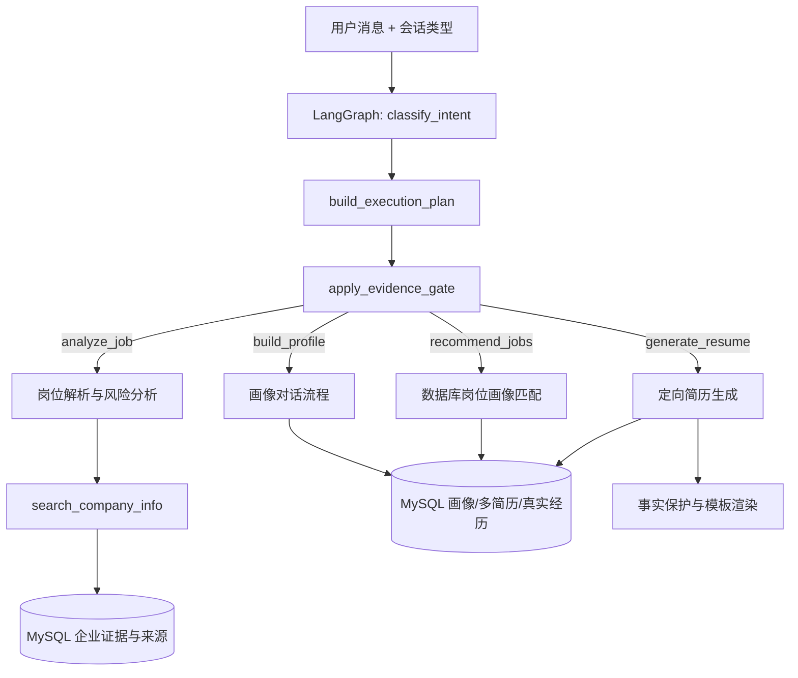

# JobGuard LangGraph 与 MCP 工具接入说明

## 当前生产结构



生产 LangGraph 真实执行 `classify_intent → build_execution_plan → apply_evidence_gate` 三节点确定性主链。它在进程内惰性编译一次，不存在重复构图、空节点或声明后未调用的节点。分类器读取 `session_type`；计划节点为五类意图生成不同业务步骤；门禁节点禁止无来源数字，并声明画像约束和简历写入所需的人机确认。具体业务由 `app/api/chat.py` 显式执行，以控制数据库事务、SSE 事件持久化和失败回滚。

可通过登录后的 `GET /api/agent/graph` 查看运行时真实节点和边；该接口不会展示伪造的“理想图”。

## MCP 工具

项目已提供官方 Python MCP SDK 实现的 stdio 服务：

```powershell
cd E:\jobguard\jobguard\backend
.\.venv\Scripts\python.exe -m app.mcp_server
```

当前暴露 6 个工具：

- `search_company_info`：读取已落库企业证据、核验状态和来源链接。
- `search_job_database`：检索 MySQL 中有效岗位并保留来源。
- `analyze_job_requirements`：对数据库岗位做结构化要求分析。
- `recommend_learning_resources`：返回按技能筛选的可核验学习资源。
- `build_company_verification_plan`：生成官方入口和人工核验步骤。
- `get_jobguard_tool_status`：返回适配器状态与真实性保护策略。

应用内 Agent 与 MCP 服务复用同一个 `search_company_info` 实现，因此不是 Codex 临时替用户查一次，也不是把浏览器登录态塞入代码。缺少来源时必须返回 `unknown/no_evidence`，不能用模型记忆补充社保人数、仲裁数量或公司口碑。

## 两个政府平台的边界

- 北京市公共数据开放平台：岗位数据通过正式下载/导入流程进入 MySQL，来源 URL 与数据集标识保留；不在后台保存 userKey、Cookie 或验证码。
- 国家企业信用信息公示系统：当前为人工核验入口。其登录、验证码和访问控制不适合作为无人值守 Agent 工具；项目不会绕过验证码或复用个人浏览器 Cookie。

后续若接入新的合法公开数据源，应实现独立适配器，输出统一的 `facts + sources + missing_dimensions` 结构，再注册为 MCP 工具。
