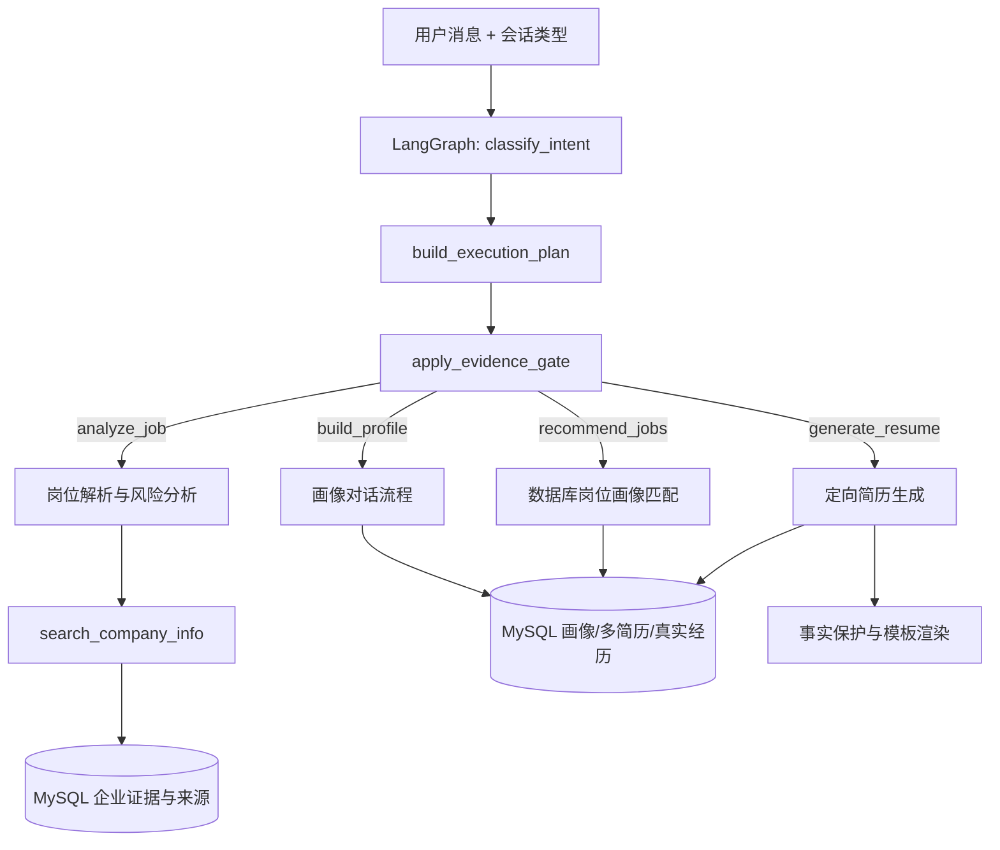

# JobGuard LangGraph 与 MCP 工具接入说明

## 当前生产结构



生产 LangGraph 真实执行 `classify_intent → build_execution_plan → apply_evidence_gate` 三节点确定性主链。它在进程内惰性编译一次，不存在重复构图、空节点或声明后未调用的节点。分类器读取 `session_type`；计划节点为五类意图生成不同业务步骤；门禁节点禁止无来源数字，并声明画像约束和简历写入所需的人机确认。具体业务由 `app/api/chat.py` 显式执行，以控制数据库事务、SSE 事件持久化和失败回滚。

可通过登录后的 `GET /api/agent/graph` 查看运行时真实节点和边；该接口不会展示伪造的“理想图”。

## MCP 工具

项目已提供官方 Python MCP SDK 实现的 stdio 服务：

```powershell
cd E:\jobguard\jobguard\backend
.\.venv\Scripts\python.exe -m app.mcp_server
```

当前暴露 8 个工具：

- `search_company_info`：读取已落库企业证据、核验状态和来源链接。
- `search_job_database`：检索 MySQL 中有效岗位并保留来源。
- `analyze_job_requirements`：对数据库岗位做结构化要求分析。
- `recommend_learning_resources`：返回按技能筛选的可核验学习资源。
- `build_company_verification_plan`：生成官方入口和人工核验步骤。
- `query_real_company_registry`：调用已配置的真实企业工商/风险数据接口，支持企查查开放平台和阿里云市场企业数据 API。
- `sync_beijing_official_jobs`：调用北京市公共数据开放平台岗位接口，返回真实岗位预览与计算机岗位过滤统计。
- `get_jobguard_tool_status`：返回适配器状态与真实性保护策略。

应用内 Agent 与 MCP 服务复用同一个 `search_company_info` 实现，因此不是 Codex 临时替用户查一次，也不是把浏览器登录态塞入代码。缺少来源时必须返回 `unknown/no_evidence`，不能用模型记忆补充社保人数、仲裁数量或公司口碑。

## 真实外部接口 Adapter

项目新增真实外部数据适配层，所有 Adapter 都遵循同一个原则：配置了合法 API Key 才发起真实请求；未配置时返回 `not_configured`；上游失败时返回 `upstream_error`；不会用 mock 数据冒充真实查询结果。

环境变量：

- `QICHACHA_APP_KEY` / `QICHACHA_SECRET_KEY` / `QICHACHA_BASE_URL`：企查查开放平台接口配置，默认基地址为 `https://api.qichacha.com`。
- `ALIYUN_COMPANY_APPCODE` / `ALIYUN_COMPANY_QUERY_URL`：阿里云市场企业工商或风险类 API 配置，不同商品的 URL 不一致，因此由环境变量指定。
- `EXTERNAL_API_TIMEOUT_SECONDS`：外部接口超时保护。

企业核验链路中，`search_company_info` 会合并 MySQL 已落库证据、公开来源线索和已配置的真实外部 API 结果。第三方商业 API 返回的数据会按“第三方报告/可追溯来源”入库，不会冒充政府官方核验；只有白名单政府域名来源才标记为 official verified。

## Agent 执行保护

Planner-Executor 链路新增 `AGENT_MAX_STEPS` 和 `AGENT_TOOL_TIMEOUT_SECONDS` 配置。执行计划超过最大步数会被截断，单个工具调用超过超时时间会失败并进入 Agent 运行记录。这样可以回答“Agent 循环执行如何避免死循环”：系统不允许开放式无限 ReAct，而是采用 Plan-and-Execute 主流程，并用有限步数、工具超时、失败状态和 Trace 做工程约束。

## 两个政府平台的边界

- 北京市公共数据开放平台：岗位数据通过正式下载/导入流程进入 MySQL，来源 URL 与数据集标识保留；不在后台保存 userKey、Cookie 或验证码。
- 国家企业信用信息公示系统：当前为人工核验入口。其登录、验证码和访问控制不适合作为无人值守 Agent 工具；项目不会绕过验证码或复用个人浏览器 Cookie。

后续若接入新的合法公开数据源，应实现独立适配器，输出统一的 `facts + sources + missing_dimensions` 结构，再注册为 MCP 工具。
